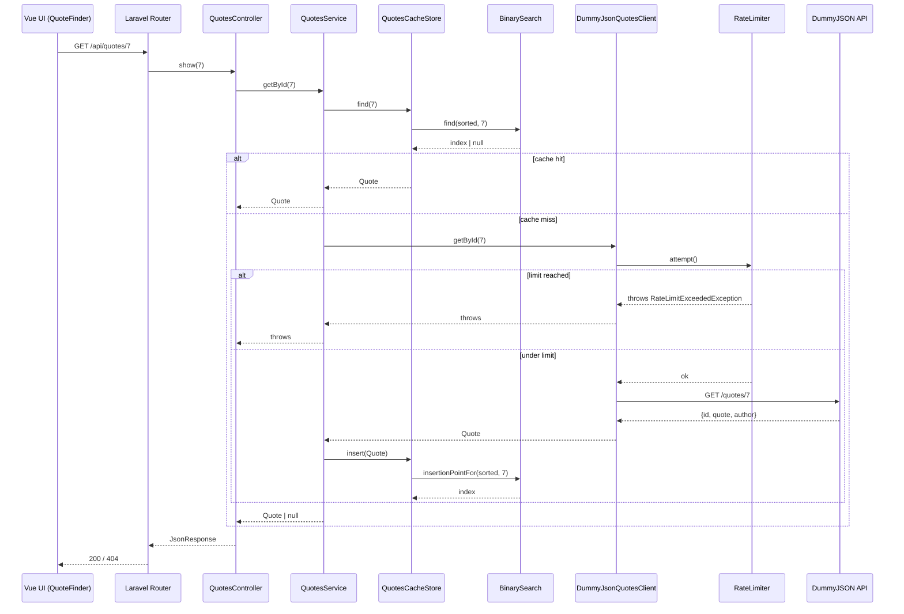
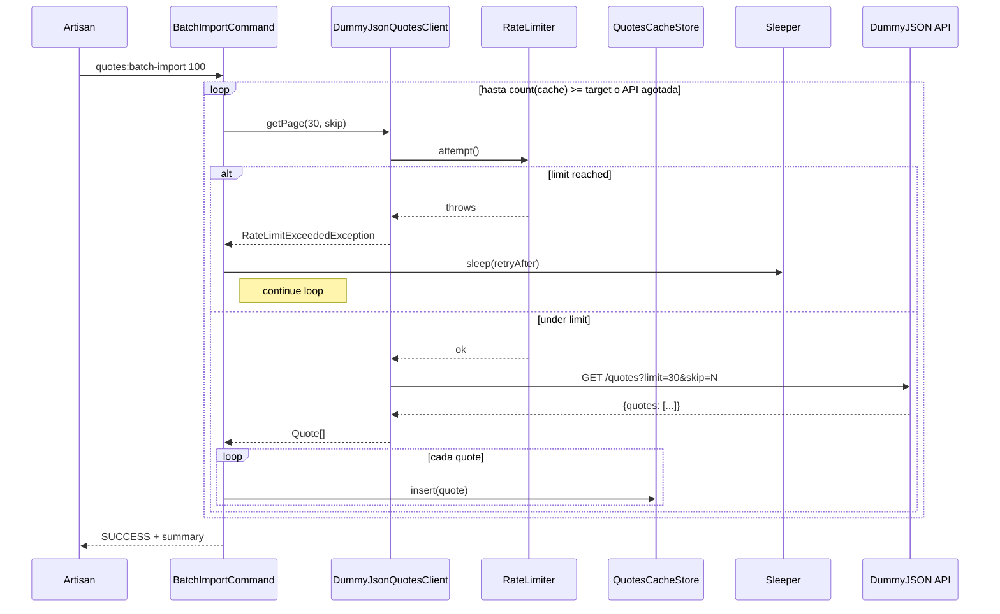

# Quotes Bridge

Paquete de Laravel que se integra con la [API de Citas DummyJSON](https://dummyjson.com/quotes). Incluye:

- Cliente HTTP basado en Saloon con un rate limiter no bloqueante que falla rápido lanzando una excepción personalizada.
- Caché plano, indexado secuencialmente y ordenado por id, con recuperación O(log n) mediante una búsqueda binaria escrita a mano.
- Comando Artisan resiliente `quotes:batch-import` que captura las excepciones de rate-limit, espera y reanuda.
- Endpoints HTTP que exponen el caché (`GET /api/quotes`, `GET /api/quotes/{id}`).
- Interfaz Vue 3 + TypeScript compilada dentro del paquete y publicable a la app host.
- Un `docker-compose.yml` que arranca un host Laravel limpio, vincula este paquete, compila el UI y lo sirve en `localhost:8080`.

## Requisitos

- PHP 8.2+
- Laravel 10, 11 o 12
- Composer 2
- Para el flujo de un solo comando: Docker + Docker Compose

---

## 1. Instalación

Hay dos caminos: usarlo dentro de una app Laravel existente, o levantar el entorno Docker descrito en la sección 2.

### Dentro de una app Laravel existente

```bash
composer config repositories.quotes-bridge path /ruta/absoluta/a/quotes-bridge
composer require antoniovila/quotes-bridge:@dev
```

El service provider se descubre automáticamente (`extra.laravel.providers` en `composer.json`), así que no requiere registro manual.

Publica la configuración:

```bash
php artisan vendor:publish --tag=quotes-config
```

Eso copia `config/quotes.php` a tu app host. Cualquier valor se puede sobrescribir desde `.env`:

```env
QUOTES_API_URL=https://dummyjson.com
QUOTES_RATE_LIMIT_MAX=30
QUOTES_RATE_LIMIT_WINDOW=60
QUOTES_CACHE_STORE=file
QUOTES_CACHE_KEY=quotes_bridge:store
QUOTES_CACHE_TTL=3600
QUOTES_PER_PAGE=20
```

Compila y publica el UI Vue:

```bash
# Dentro del directorio del paquete
npm install
npm run build

# En la app host
php artisan vendor:publish --tag=quotes-bridge-assets --force
```

A partir de ahí, el UI queda disponible en `/quotes-ui` y los endpoints en `/api/quotes`.

---

## 2. Docker

El paquete incluye un entorno de un solo comando que compila el paquete, genera un host Laravel desde cero, vincula el paquete vía path repository de Composer, compila el UI Vue, publica los assets, y sirve todo a través de nginx + php-fpm + supervisord en el puerto 8080.

```bash
docker-compose up --build
```

Cuando termine el bootstrap (el entrypoint imprime `Bootstrap complete. Starting supervisord.`), abre:

- `http://localhost:8080/quotes-ui` — el UI Vue (lista paginada + búsqueda por id).
- `http://localhost:8080/api/quotes` — listado JSON paginado.
- `http://localhost:8080/api/quotes/{id}` — quote individual por id (404 si no existe).

La primera ejecución descarga la imagen base, corre `composer create-project laravel/laravel:^12.0`, requiere este paquete, hace `npm install` y `npm run build`, publica los assets y arranca el stack web. Las siguientes ejecuciones saltan lo que ya esté en su sitio.

El código del paquete vive en `/package` dentro del contenedor (montado desde el host) y la app host generada en `/var/www/host`.

---

## 3. Estrategia de rate-limiting

El rate limiter es un **contador de ventana fija no bloqueante** persistido en `Illuminate\Contracts\Cache\Repository`.

### Mecánica

`AntonioVila\QuotesBridge\Services\RateLimiter`:

- Mantiene un contador en `quotes.rate_limit.cache_key` con TTL igual a la ventana configurada (`quotes.rate_limit.window_seconds`).
- Cada petición pasa por `RateLimiter::attempt()` antes de salir el HTTP.
- Si el contador alcanza `quotes.rate_limit.max_requests`, `attempt()` lanza `RateLimitExceededException` de inmediato. **No** duerme. La excepción transporta `retryAfter` (segundos), `maxRequests` y `windowSeconds`.
- La ventana se reinicia naturalmente cuando expira el TTL del caché.

Esto cumple la regla de "no bloqueante": si la capa de servicio choca con el límite, falla rápido y deja al llamador decidir qué hacer.

### CLI vs. servicio

La capa de servicio es deliberadamente no bloqueante. La capa de CLI es deliberadamente **resiliente**:

`AntonioVila\QuotesBridge\Console\BatchImportCommand` (`php artisan quotes:batch-import {count} --page-size=30`) envuelve cada petición de página en `try`/`catch (RateLimitExceededException $e)`. Al ocurrir, duerme `$e->retryAfter` segundos (vía un `Sleeper` inyectable — `RealSleeper` en producción, `FakeSleeper` en tests) y reanuda el bucle hasta alcanzar la cantidad objetivo de quotes únicos o agotar la API upstream.

Tests que lo cubren:

- `tests/Unit/RateLimiterTest.php` — bajo límite, sobre límite, retry-after, reset y prueba de "fail-fast" (≤100 ms de tiempo de pared).
- `tests/Feature/BatchImportCommandTest.php` — happy path, reintento tras `RateLimitExceededException`, parada elegante cuando la API se queda sin quotes.

---

## 4. Análisis de complejidad

### Forma del caché

El payload cacheado es un wrapper alrededor de un array PHP plano, indexado secuencialmente y ordenado ascendente por id, con un flag booleano `is_hydrated` aplicado antes de la serialización (como pide la consigna):

```php
[
    'quotes' => [
        ['id' => 1, 'quote' => '...', 'author' => '...'],
        ['id' => 2, 'quote' => '...', 'author' => '...'],
        // índices secuenciales 0..N-1, ids estrictamente ascendentes
    ],
    'is_hydrated' => true,
]
```

Los ids de las quotes **nunca** se usan como claves del array — solo como valor a comparar durante la búsqueda. Los índices se mantienen secuenciales `0..N-1`.

### Búsqueda binaria

`AntonioVila\QuotesBridge\Cache\BinarySearch::find()` es una búsqueda binaria iterativa de manual, usando `$low`, `$high` y `$mid = intdiv($low + $high, 2)`. En cada iteración:

1. Compara `$sorted[$mid]->id` contra el id objetivo.
2. Devuelve `$mid` si son iguales.
3. Descarta la mitad inferior si el candidato es menor (`$low = $mid + 1`).
4. Descarta la mitad superior si es mayor (`$high = $mid - 1`).

Termina cuando `$low > $high`. En cada paso el intervalo se reduce a la mitad, así que el peor caso de comparaciones está acotado por `⌈log₂(n)⌉ + 1`.

El test `tests/Unit/BinarySearchTest.php` lo demuestra empíricamente: con `n = 1024`, `lastComparisons` nunca supera 11 ni para el peor caso de elemento existente ni para uno faltante, y se mantiene cómodamente por debajo de `n / 10`.

### Inserción

`BinarySearch::insertionPointFor()` reutiliza el mismo bucle de halving para encontrar la posición donde un nuevo id debe insertarse manteniendo el orden — también O(log n). El método `QuotesCacheStore::insert()` que envuelve la lógica luego llama a `array_splice($sorted, $pos, 0, [$quote])` (shift O(n)) y persiste. Si el id ya existe, la entrada existente se reemplaza en su lugar en lugar de duplicarse. Las inserciones que ocurren por miss en `getById` **no** flippean `is_hydrated` a `true`; solo un `markHydrated()` explícito (llamado tras un `getAll` completo) lo hace.

### Razonamiento al nivel del servicio

`QuotesService::getAll()` corta camino al caché solo cuando `isHydrated()` es `true`. Un caché que tenga unas pocas entradas dejadas por miss anteriores en `getById` se trata como **parcial**, no autoritativo — `getAll()` igual va al cliente upstream para hidratar y luego llama a `markHydrated()`.

`QuotesService::getById($id)` es cache-first: si `BinarySearch::find()` da un hit, la llamada de red se evita por completo; si hay miss, se llama al cliente, el resultado se inserta en orden y el array persistido sigue ordenado.

---

## 5. Enfoque técnico

El paquete está compuesto de unidades pequeñas y reemplazables detrás de interfaces, así cada pieza es testeable en aislamiento y el conjunto se compone via el container de Laravel.

### Arquitectura

```
QuotesController ──> QuotesService ──> QuotesClient (interfaz)
                            │                │
                            │                ├─ DummyJsonQuotesClient ──> Saloon Connector ──> RateLimiter
                            │                │
                            │                └─ FakeQuotesClient (tests)
                            │
                            └──> QuotesCacheStore ──> BinarySearch
                                                  ──> Illuminate\Cache\Repository

BatchImportCommand ──> QuotesClient
                  └──> QuotesCacheStore
                  └──> Sleeper (RealSleeper | FakeSleeper)
```

### Decisiones y por qué

- **Saloon para HTTP**: idiomático, mockeable vía `MockClient`, y explícito sobre la forma de la petición (una clase por endpoint). La lógica de rate-limit queda en `RateLimiter` y por tanto independiente del transporte.
- **Interfaz `QuotesClient`** en `src/Contracts/`: el único punto de inserción que la capa de servicio conoce. La implementación Saloon, el fake para tests y el `RateLimitOnceQuotesClient` específico para tests de reintento la implementan sin filtrar detalles de transporte.
- **Interfaz `Sleeper`**: aísla `time` fuera de `BatchImportCommand`. Los tests usan `FakeSleeper` para verificar el camino de reintento (los sleeps registrados se asertan) sin correr en tiempo real.
- **`QuotesCacheStore` es dueño de las invariantes**: cada camino de persistencia pasa por un único lugar que mantiene el array ordenado, indexado secuencialmente y etiquetado con `is_hydrated`. Ni el controller ni el service tocan el formato wire.
- **La búsqueda binaria está escrita a mano**: la consigna lo pide. Ninguna dependencia externa. La clase también expone `lastComparisons` para que los tests prueben el bound O(log n) en lugar de solo confiar en él.
- **Testing en dos capas**:
  - Tests unitarios contra el cache `array` y el `MockClient` de Saloon ejercitan la lógica pura y la frontera HTTP.
  - Feature tests vía `orchestra/testbench` arrancan una app Laravel virtual con el provider real, registran las rutas y golpean endpoints / comandos de extremo a extremo. `app->instance(QuotesClient::class, $fake)` reemplaza el upstream justo antes de cada test.
- **Vue 3 Composition API + TypeScript + Vite**: el composable `useQuotes` maneja el estado de paginación; `QuoteList`, `QuoteCard`, `Pagination` y `QuoteFinder` son componentes pequeños dirigidos por props. La config de Vite usa `base = '/vendor/quotes-bridge/'` y la blade del host lee el manifest publicado en `public/vendor/quotes-bridge/` para resolver los assets con hash.
- **Docker como un solo servicio**: nginx + php-fpm bajo supervisord en una imagen, un volumen montado para el código del paquete. El entrypoint genera la app host desde cero, conecta el path repository, compila el UI, publica los assets y fuerza `CACHE_STORE=file` (Laravel 12 viene con `database` por default y este entorno de prueba no tiene DB).

### Tradeoffs aceptados explícitamente

- El caché usa el `Cache` repository estándar de Laravel. Dos escritores paralelos pueden competir sobre el array; para el alcance de esta prueba un esquema de locking más elaborado (ej. `Cache::lock()`) no era necesario y solo agregaría ceremonia.
- `QuotesService::getAll()` siembra el caché desde una sola llamada `getPage(100, 0)`. Para datasets reales que excedan 100 quotes, el bucle de paginación del CLI es la herramienta correcta — el endpoint `GET /api/quotes` es una fachada sobre lo que ya hay en caché.
- La app host del Docker pinea `laravel/laravel:^12.0`. El paquete en sí soporta Laravel 10/11/12 (`illuminate/* "^10.0|^11.0|^12.0"`), así que se puede instalar en hosts más viejos sin cambios.

---

## Diagramas de flujo

### `GET /api/quotes/{id}`

Cache-first lookup. La búsqueda binaria decide si hace falta tocar la API upstream.



### `php artisan quotes:batch-import {count}`

A diferencia del endpoint, este flujo **sí** captura `RateLimitExceededException`, espera, y continúa.



---

## Referencia de endpoints

| Método | Path | Descripción |
|---|---|---|
| GET | `/api/quotes?page=&per_page=` | Listado paginado (cache-first; hidrata el caché en la primera llamada). |
| GET | `/api/quotes/{id}` | Quote individual por id. Hit en caché ⇒ búsqueda binaria. Miss ⇒ upstream + insert. |
| GET | `/quotes-ui` | SPA Vue 3 con navegador paginado + buscador por id. |

## Facade

```php
use AntonioVila\QuotesBridge\Facades\Quotes;

Quotes::getAll();   // Quote[]
Quotes::getById(7); // Quote|null
```

## CLI

```bash
php artisan quotes:batch-import 100 --page-size=30
```

Importa hasta 100 quotes únicas al caché, reintentando ante `RateLimitExceededException` hasta cumplir el objetivo o agotar la API upstream.

## Correr los tests

```bash
composer install
php vendor/bin/pest
```

48 tests, 113 assertions distribuidos en:

- `tests/Unit/` — Quote DTO, Saloon connector + requests, RateLimiter, BinarySearch, QuotesCacheStore, DummyJsonQuotesClient, QuotesService, Quotes facade.
- `tests/Feature/` — `/api/quotes` + `/api/quotes/{id}` vía testbench, `quotes:batch-import` happy path + reintento + parada elegante.

## Licencia

MIT.
